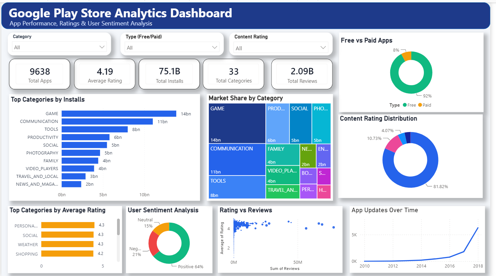

# Google Play Store App Review Analysis

## Project Overview

This project focuses on analyzing Google Play Store app data along with user reviews to understand the key factors that influence app success, user engagement, and overall performance.

The project combines Exploratory Data Analysis (EDA) using Python and interactive data visualization using Power BI to extract meaningful insights that can help developers and businesses make better decisions.

---

## Business Objective

The main objective of this project is to analyze app-related data and user feedback to identify:

* What makes an app successful
* Factors affecting installs and ratings
* User sentiment and satisfaction
* Opportunities for improving app performance
* Market trends across different app categories

---

## Dataset Information

### 1. Play Store Data

Contains app details such as:

* App Name
* Category
* Rating
* Reviews
* Installs
* Size
* Price
* Type (Free/Paid)
* Content Rating
* Genres

### 2. User Reviews Data

Contains:

* App Name
* User Reviews
* Sentiment (Positive, Negative, Neutral)
* Sentiment Polarity
* Sentiment Subjectivity

---

## Data Cleaning & Preprocessing

The following preprocessing steps were performed:

* Removed duplicate records
* Handled missing values using median and mode
* Converted columns such as Installs, Price, and Size into numeric format
* Removed invalid values (for example, ratings greater than 5)
* Cleaned text data for better analysis
* Standardized column formats

---

## Exploratory Data Analysis (EDA)

The following analyses were performed:

* Distribution of App Ratings
* Category-wise App Distribution
* Free vs Paid Apps Analysis
* Relationship between Installs and Ratings
* Reviews vs Installs Analysis
* Price Distribution Analysis
* User Sentiment Analysis
* Correlation Heatmap
* Pair Plot for Multi-variable Relationships

---

## Power BI Dashboard

An interactive Power BI dashboard was created to visualize important insights and business metrics.

### Dashboard Features

* KPI Cards

  * Total Apps
  * Average Rating
  * Total Installs
  * Total Reviews
  * Total Categories

* Interactive Filters

  * Category
  * Type (Free/Paid)
  * Content Rating

* Visualizations

  * Top Categories by Installs
  * Market Share by Category
  * Free vs Paid Apps
  * Content Rating Distribution
  * Top Categories by Average Rating
  * User Sentiment Analysis
  * Rating vs Reviews
  * App Updates Over Time

### Dashboard Preview



### Power BI File

`Playstore_dashboard.pbix`

---

## Key Insights

* Free apps dominate the Play Store and have significantly higher installs.
* Most apps have ratings between 4.0 and 4.5.
* There is a strong positive relationship between installs and reviews.
* Ratings alone do not guarantee app success.
* User sentiment is mostly positive but highlights areas for improvement.
* Paid apps have lower installs compared to free apps.
* Game and Communication categories contribute the highest number of installs.

---

## Business Recommendations

* Focus on a freemium model (Free + Ads/In-App Purchases).
* Improve user experience to maintain high ratings.
* Use user reviews to identify and fix app issues.
* Encourage users to leave reviews to increase trust.
* Choose app categories carefully by analyzing market competition.

---

## Limitations

* The dataset may not be fully up-to-date.
* Ratings may contain user bias.
* Sentiment analysis is basic and may not capture complete context.
* Some assumptions made during data cleaning may affect results.

---

## Future Scope

* Build an App Recommendation System.
* Perform advanced Sentiment Analysis using NLP.
* Predict app ratings using Machine Learning.
* Analyze user behavior patterns in greater detail.
* Deploy the project as an interactive web application.

---

## Tools & Technologies Used

* Python
* Pandas
* NumPy
* Matplotlib
* Seaborn
* Power BI
* Jupyter Notebook

---

## Repository Structure

```text
EDA-Play-Store-App-Review-Analysis
│
├── EDA_Play_Store_App_Review_Analysis.ipynb
├── Playstore_dashboard.pbix
├── Dashboard.png
├── README.md
```

---

## Conclusion

This project demonstrates that app success depends on multiple factors such as user engagement, reviews, pricing strategy, category selection, and overall user experience.

Using Python for EDA and Power BI for interactive visualization provides valuable insights that can help developers and businesses make data-driven decisions and improve app performance.
